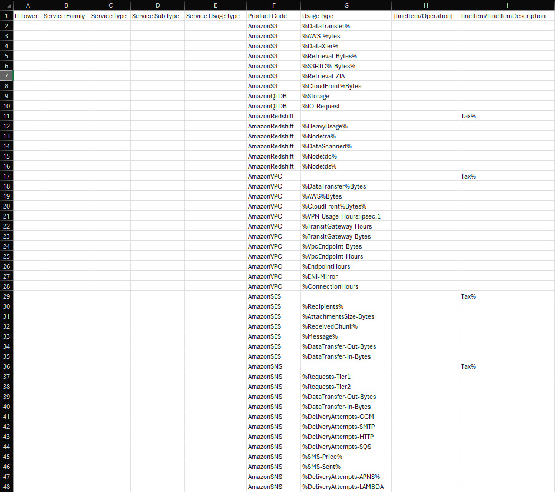
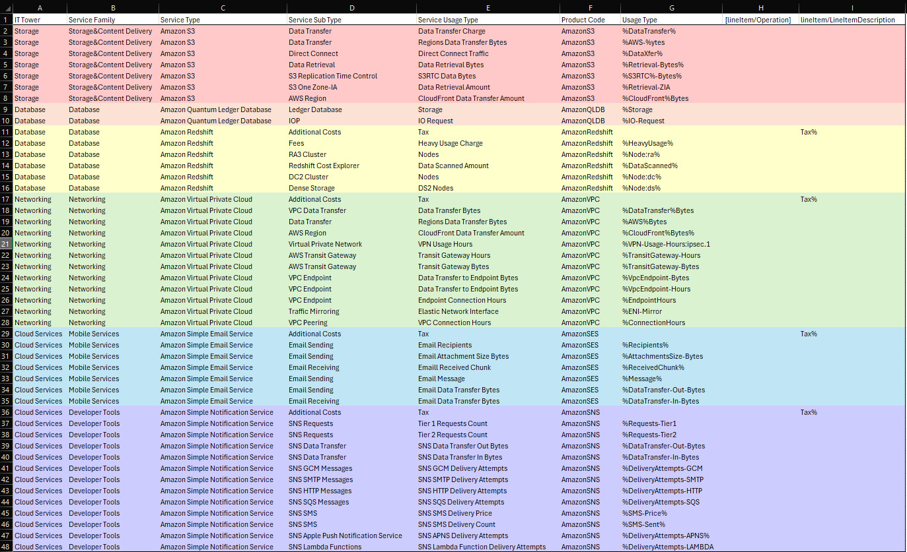

# Лабораторная работа 1. Знакомство с IaaS, PaaS, SaaS сервисами в облаке на примере Amazon Web Services (AWS). Создание сервисной модели.

## Задание 

**Цель работы:** Знакомство с облачными сервисами. Понимание уровней абстракции над инфраструктурой в облаке. Формирование понимания типов потребления сервисов в сервисной-модели. 

**Дано:** 
1. Слепок данных биллинга от провайдера после небольшой обработки в виде SQL-параметров. Символ % в начале/конце означает, что перед/после него может стоять любой набор символов.
2. Образец итогового соответствия, что желательно получить в конце. В этом же документе  

**Необходимо:** 
1. Импортировать файл .csv в Excel или любую другую программу работы с таблицами. Для Excel делается на вкладке Данные – Из текстового / csv файла – выбрать файл, разделитель – точка с запятой.
2. Распределить потребление сервисов по иерархии, чтобы можно было провести анализ от большего к меньшему (напр. От всех вычислительных ресурсов Compute дойти до конкретного типа использования - Выделенной стойка в датацентре Dedicated host usage).
3. Сохранить файл и залить в соответствующую папку на Google Drive.

**Алгоритм работы:** Сопоставить входящие данные от провайдера с его же документацией. Написать в соответствие колонкам справа значения 5 колонок слева, которые бы однозначно классифицировали тип сервиса. Для столбцов IT Tower и Service Family значения можно выбрать из образца.

## Выполнение лабораторной работы 

Сначала был импортирован в Excel слепок данных биллинга от провайдера. Представлен на рисунке ниже:

Далее попытаемся разобраться с нашими сервисами (Product Code) и тем, что они делают:

#### AmazonS3

Amazon Simple Storage Service (S3) -- Облачное хранилище AWS, организованное по объектному принципу, с возможностями защиты, анализа и управления данными любого масштаба. Предоставляет хранилища данных различных классов (S3 Intelligent-Tiering, S3 Express One Zone, S3 Glacier, S3 Glacier Instant Retrieval) под варьирующиеся нужды клиентов. 

#### AmazonQLDB
Amazon Quantum Ledger Database (QLDB) -- полностью управляемая база данных реестров, обеспечивающая прозрачный, неизменяемый и проверяемый криптографическими методами журнал транзакций. С середины 2024 года больше не принимает новых клиентов :(

#### AmazonRedshift

Облачный сервис для хранения данных петабайтного масштаба, основанный на PostgreSQL. Позволяет легко выполнять масштабирование, имеет встроенный функционал для обеспечения безопасности данных, администрирования, анализа, интеграции с машинным обучением.

#### AmazonVPC

Amazon Virtual Private Cloud (VPC) -- сервис, позволяющий запускать ресурсы AWS в логически изолированной виртуальной сети. Amazon VPC дает полный контроль над виртуальной сетевой средой, включая распределение ресурсов, подключение и безопасность. 

#### AmazonSES

Amazon Simple Email Service (SES) -- облачный поставщик сервисов электронной почты, который может быть интегрирован в любое приложение для автоматизации больших объемов электронной почты. Позволяет удобно ~~спамить~~ массово рассылать электронную почту, автоматизировать транзакционные сообщения, предоставляет отчёты по статистике отправителей и т.п. 

#### AmazonSNS

Amazon Simple Notification Service (SNS) -- сервис посылки уведомлений между сетевыми компонентами Amazon Web Services и внешними компонентами. Обеспечивает массовую доставку сообщений в сложной сети. Уведомления, отправленные через SNS, могут быть получены через Amazon Data Firehose, Amazon SQS, AWS Lambda, HTTP, email, мобильные пуш уведомления и SMS.

С помощью документации AWS и примера выполнения лабораторной работы была заполнена таблица (очень надеюсь, что правильно...):

## Вывод

В ходе первой лабораторной работы были изучены различные AWS, проведена работа с их документацией. Можно сделать вывод, что сервисов крайне много, и они предоставляют решения почти для любой проблемы (в отличие от их документации). 
