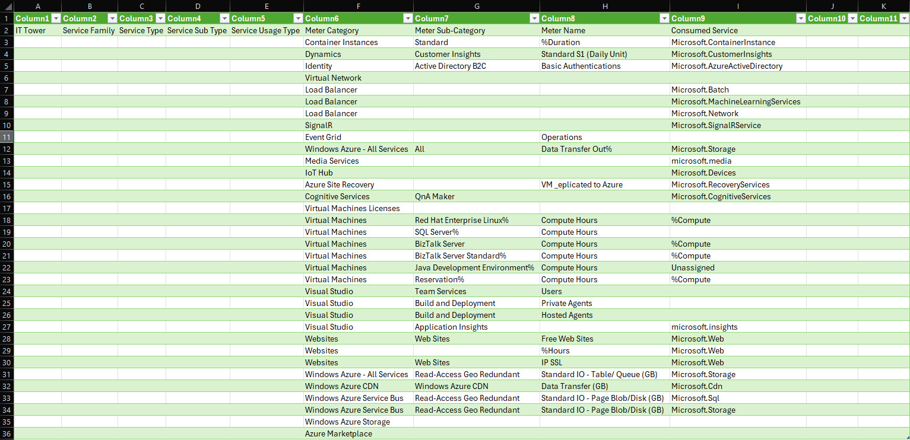
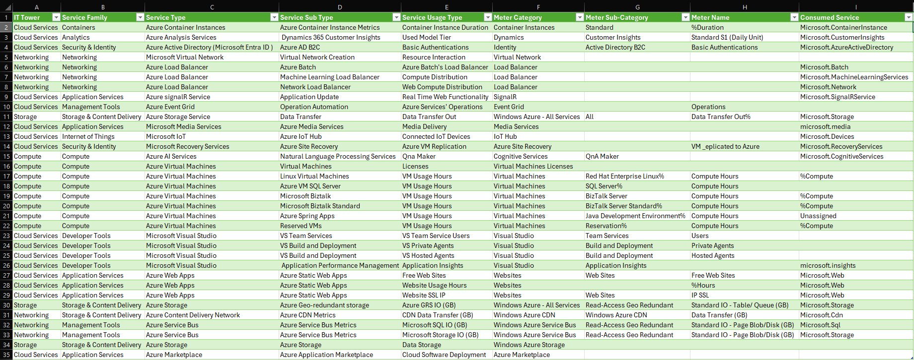

# Лабораторная работа 2. Сравнение сервисов Amazon Web Services и Microsoft Azure. Создание единой кросс-провайдерной сервисной модели.

## Задание

**Цель работы:** Получение навыков аналитики и понимания спектра публичных облачных сервисов без привязки к вендору. Формирование у студентов комплексного видения Облака. 

**Дано:**
1. Данные лабораторной работы 1.
2. Слепок данных биллинга от провайдера после небольшой обработки в виде SQL-параметров. Символ % в начале/конце означает, что перед/после него может стоять любой набор символов.
3. Образец итогового соответствия, что желательно получить в конце. В этом же документе

**Необходимо:**
1. Импортировать файл .csv в Excel или любую другую программу работы с таблицами. Для Excel делается на вкладке Данные – Из текстового / csv файла – выбрать файл, разделитель – точка с запятой.
2. Распределить потребление сервисов по иерархии, чтобы можно было провести анализ от большего к меньшему (напр. От всех вычислительных ресурсов Compute дойти до конкретного типа использования - Выделенной стойка в датацентре Dedicated host usage). При этом сохранять логическую концепцию, выработанную в Лабораторной работе 1.
3. Сохранить файл и залить в соответствующую папку на Google Drive.

**Алгоритм работы:** Сопоставить входящие данные от провайдера с его же документацией. Написать в соответствие колонкам справа значения 5 колонок слева, которые бы однозначно классифицировали тип сервиса. Для столбцов IT Tower и Service Family значения можно выбрать из образца. В ходе выполнения работы не отходить от принципов классификации, выбранных в Лабораторной работе 1. Например, если сервис Машинного обучения был разбит на Вычислительные мощности и Облачные сервисы, то продолжать его разбивать и в новых данных.

## Выполнение работы

Для начала был скачан один из слепков данных биллинга от провайдера. В незаполненном виде он представлен на рисунке ниже:

С помощью документации Azure и других ресурсов сети интернет таблица была заполнена: 

Опишем встретившиеся нам в процессе выполнения лабораторной работы сервисы. 

#### Azure Container Instances
Сервис для контейнеризации. ACI дает возможность быстро создавать и запускать контейнеризированные приложения с помощью легко создаваемых наборов команд. 

#### Azure Analysis Services 

Полностью управляемая платформа как услуга (PaaS), которая предоставляет модели данных корпоративного уровня в облаке.

#### Azure Active Directory

(Теперь Microsoft Entra ID) облачная служба от корпорации Microsoft для управления идентификацией и доступом, которая сочетает в себе возможности единого доступа к любому облачному и локальному приложению с расширенной защитой. 
#### Microsoft Virtual Network

#### Azure Load Balancer

подсистема балансировки нагрузки Azure. Позволяет с легкостью развертывать и масштабировать виртуальные модули.

#### Azure signalR Service

служба для легкого добавления real-time веб-функционала в приложения. 

#### Azure Event Grid

служба маршрутизации событий и обмена сообщениями между приложениями. 

#### Azure Storage Service 

Сервис, предоставляющий услуги хранения данных в облаке Microsoft. Имеет большое количество компонентов для различных нужд пользователя -- высокая степень масштабирования, длительность хранения, выполнение вычислений и т.д. 

#### Microsoft Media Services 

сервисы технологии платформы Microsoft Media Platform, которые доступны из облака в формате SaaS (Software as Service) и PaaS (Platform as Service). Предоставляет возможности масштабирования, а также использования совместно с собственными средствами кодирования, вещания и распространения контента. Платформа позволяет загружать контент, проводить его перекодирование и конвертацию, организовывать прямые трансляции, вещание по расписанию и встраивать видео на сайты. Также пользователям доступна защита контента, работа с рекламой и аналитикой.

#### Microsoft IoT

IoT платформа для соединения, контроля и мониторинга устройств с помощью облачных решений. 

#### Microsoft Recovery Services

Сервис, который позволяет сохранять бэкапы данных с машин, работающих под управлением Windows Server для обеспечения сохранности данных.

#### Azure AI Services

Облачные службы ИИ, помогают разработчикам и организациям быстро создавать интеллектуальные, передовые, готовые к рынкам и ответственные приложения с готовыми и предварительно созданными и настраиваемыми API и моделями.

#### Azure Virtual Machines

служба для предоставления виртуальных машин на базе Linux/Windows. 

#### Microsoft Visual Studio

среда разработки от Microsoft, поддерживающая простую и удобную интеграцию приложений в Azure. 

#### Azure Web Apps 

служба для быстрого создания и развертывания web-приложений. 

#### Azure CDN

Azure Content Delivery Network -- распределённая сеть Web-серверов Azure, предназначенная для ускоренной доставки контента пользователям. 

#### Azure Service Bus

высоконадежная облачная система для обмена сообщениями между приложениями и службами

#### Azure Marketplace

маркетплейс для покупки и быстрого развертывания облачных приложений. 

## Вывод

В ходе второй лабораторной работы были рассмотрены облачные сервисы Microsoft Azure по алгоритму, применённому в первой работе с AWS. Сервисы Azure отличаются от AWS в некоторой степени, но в основном предлагают похожие решения. 

