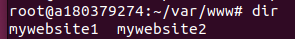
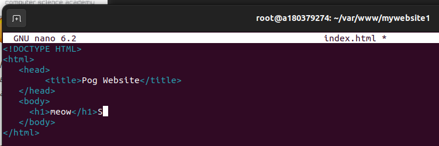

# Лаба 1 DevOps... 

20 число, поэтому пора что-нибудь сделать!!! 

### Задание:

Настроить nginx по заданному тз:
1. Должен работать по https c сертификатом
2. Настроить принудительное перенаправление HTTP-запросов (порт 80) на HTTPS (порт 443) для обеспечения безопасного соединения.
3. Использовать alias для создания псевдонимов путей к файлам или каталогам на сервере.
4. Настроить виртуальные хосты для обслуживания нескольких доменных имен на одном сервере.
5. ~~Что угодно еще под требования проекта~~

Приступим!

### Устанавливаем nginx

За целые 5 евро уже был куплен VPS для лабы, поэтому попытаемся к нему подключится через ssh. 

Со второй попытки, но получилось! Пора установить всевозможные апдейты а потом, так и быть, nginx тоже. 

После установки nginx через `sudo apt install nginx` проверим его существование с помощью `service status nginx`:

Живой! Ура. 

Удивительно, но даже ввод ip-адреса VPS'a в браузере показывает, что nginx работает. Я сделал что-то правильно. 

Но радоваться пока не стоит, потому что всё самое сложное впереди. 

### Вебсайтусы

Сначала создаём две директории (под 2 вебсайта) используя `mkdir -p var/www/mywebsite1` & `mkdir -p var/www/mywebsite2`. С помощью `dir` проверяем, что они реально существуют. (Как я понял, использование var/www/ носит чисто рекомендательный характер, но раз так делают умные люди, то будем делать так же.) 

Yippee! 

Залетаем в первую директорию и создаём index.html: `nano index.html`. Там пишем код, представленный на картинке ниже (за исключением буквы S, которую я добавил случайно, по привычке пытаясь заскринить через Win+Shift+S...), с надеждой, что в будущем всё заработает. Сохраняем через 'Ctrl+O', выходим через 'Ctrl+X'. 
 

Проверить, что всё лежит на месте, можно через `cat index.html`. Всё лежит на месте.

Повторяем процесс для второй директории. На страничку второго вебсайта попробуем запихнуть картинку, потому что мне нечего делать, кроме как наживать себе лишних проблем за 7 часов до дедлайна! Для этого научимся работать с scp.

Круто! Теперь опять делаем простенький index.html как это было сделано выше. Просто в body добавляем ``
