# Лаба 1 DevOps... 

20 число, поэтому пора что-нибудь сделать!!! 

### Задание:

Настроить nginx по заданному тз:
1. Должен работать по https c сертификатом
2. Настроить принудительное перенаправление HTTP-запросов (порт 80) на HTTPS (порт 443) для обеспечения безопасного соединения.
3. Использовать alias для создания псевдонимов путей к файлам или каталогам на сервере.
4. Настроить виртуальные хосты для обслуживания нескольких доменных имен на одном сервере.
5. ~~Что угодно еще под требования проекта~~

Приступим!

### Устанавливаем nginx

За целые 5 евро уже был куплен VPS для лабы, поэтому попытаемся к нему подключится через ssh. 
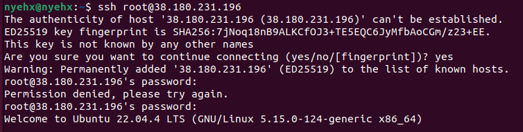

Со второй попытки, но получилось! Пора установить всевозможные апдейты а потом, так и быть, nginx тоже. 

После установки nginx через `sudo apt install nginx` проверим его существование с помощью `service status nginx`:
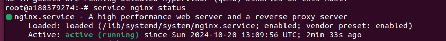

Живой! Ура. 

Удивительно, но даже ввод ip-адреса VPS'a в браузере показывает, что nginx работает. Я сделал что-то правильно. 

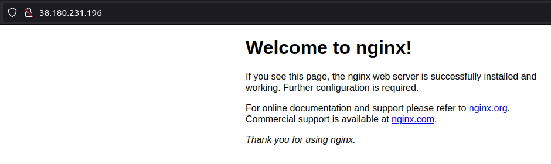

Но радоваться пока не стоит, потому что всё самое сложное впереди. 

### Вебсайтусы

Сначала создаём две директории (под 2 вебсайта) используя `mkdir -p /var/www/mywebsite1` & `mkdir -p /var/www/mywebsite2`. С помощью `dir` проверяем, что они реально существуют. (Как я понял, использование /var/www/ носит чисто рекомендательный характер, но раз так делают умные люди, то будем делать так же.) 

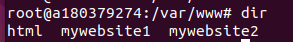

Yippee! 

Залетаем в первую директорию и создаём index.html: `nano index.html`. Там пишем код, представленный на картинке ниже, с надеждой, что в будущем всё заработает. Сохраняем через 'Ctrl+O', выходим через 'Ctrl+X'. 
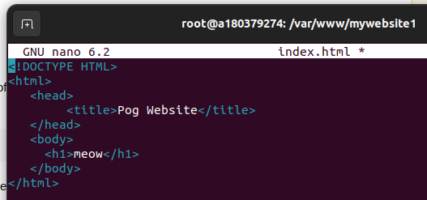 

Проверить, что всё лежит на месте, можно через `cat index.html`. Всё лежит на месте.

Повторяем процесс для второй директории. На страничку второго вебсайта попробуем запихнуть картинку, потому что мне нечего делать, кроме как наживать себе лишних проблем за 7 часов до дедлайна! Для этого научимся работать с scp.

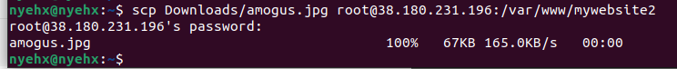

Круто! Теперь опять делаем простенький index.html как это было сделано выше. Просто в body добавляем ``

### Ставим nginx

Создаём файлы конфигураций через `sudo nano /etc/nginx/sites-available/pogwebsite1` (и 2, соответственно). Туда напишем простой конфиг, пока работающий на 80 порту по http. 
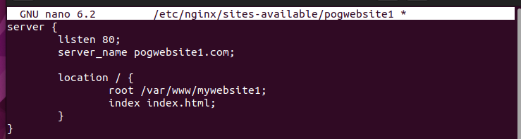 

То же самое, но с другой директорией пишем и для второго сайта. 

Далее, подключаем нашу конфигурацю nginx, добавляя в sites-enabled ссылки на наши файлы в sites-available:
```
sudo ln -s /etc/nginx/sites-available/pogwebsite1 /etc/nginx/sites-enabled/
sudo ln -s /etc/nginx/sites-available/pogwebsite2  /etc/nginx/sites-enabled/
```

Рестартим nginx через `sudo service nginx restart`.  Добавляем адрес наших вебсайтов и ip VPS'a в `/etc/hosts` и молимся, запуская веб-сайты через браузер.

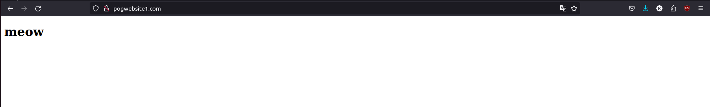
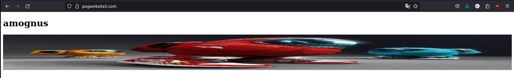

 Игнорируем тот ужас, который случился с картинкой во втором вебсайте, и радуемся победе. 

 ### Редирект на Https

Сначала нам нужно будет сгенерировать самоподписанные ssl-сертификаты. Для этого проверяем установку openssl и используем такую вот команду:
```
openssl req -newkey rsa:4096 \
            -x509 \
            -sha256 \
            -days 3650 \
            -nodes \
            -out ~/keys/pogwebsite1.crt \
            -keyout ~/keys/pogwebsite1.key
```

То же самое повторяем для второго вебсайта, и, дважды ответив на наиинтереснейшие вопросы, радуемся своим двум ключам. Пора переписывать нгинкс конфиги наших вебсайтов!!! 

Немного пописали и получили следующее:

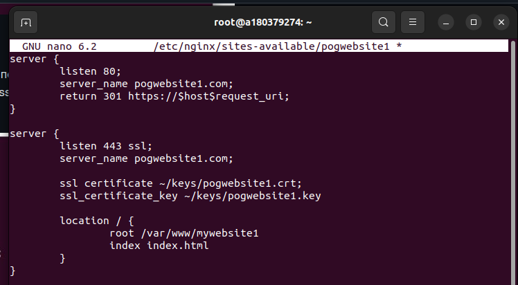

Tada!~ Для второго вебсайта всё то же самое. 

Пытаемся рестартить nginx, находим у себя в конфиге 20000 ошибок и отчисляемся из ИТМО. Спасибо за внимание!

Перепоступаем в следующем году и на 2 курсе садимся менять конфиг. 

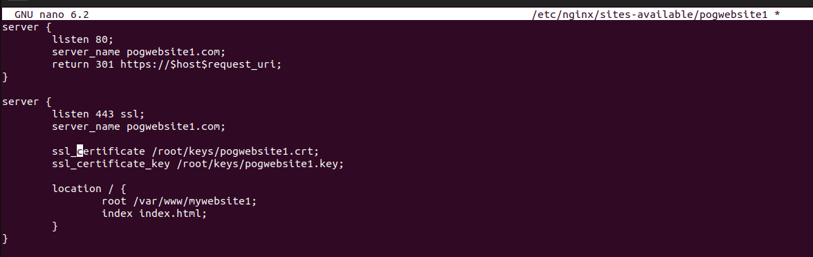

Наконец, всё работает. Чтобы проверить, пытаемся перейти по `http://pogwebsite2.com`, и улетаем на https версию. Firefox нас боится, но зато признаёт наше существование:

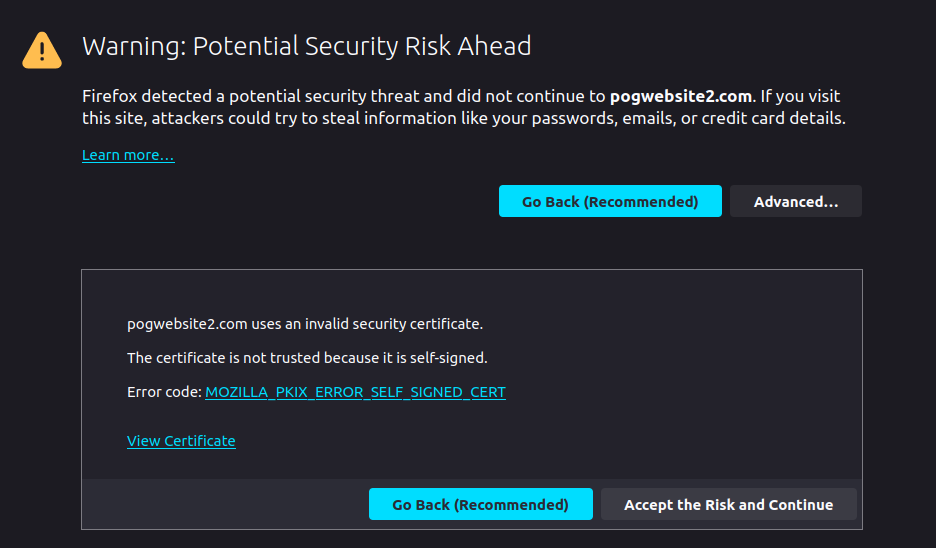

### Alias

Теперь на одном из вебсайтов создадим какую-нибудь неприятную ц**е**почку каталогов, и пропишем на неё alias. 
Изменяем немного код, получаем вот такой в итоге:
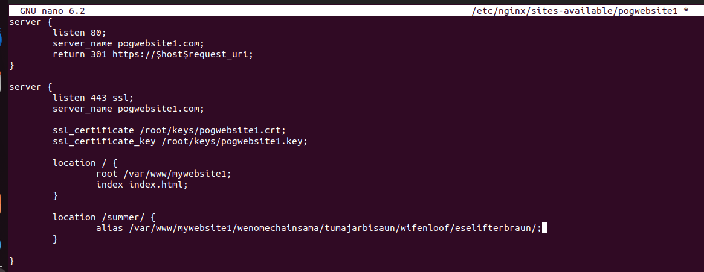

Теперь вместо длинного пути пользователь сможет обращаться к файлам, лежащим в папке eselifterbraun через /summer/ ! Добавим в последнюю папку файл page.html и проверим работоспособность псевдонима. 
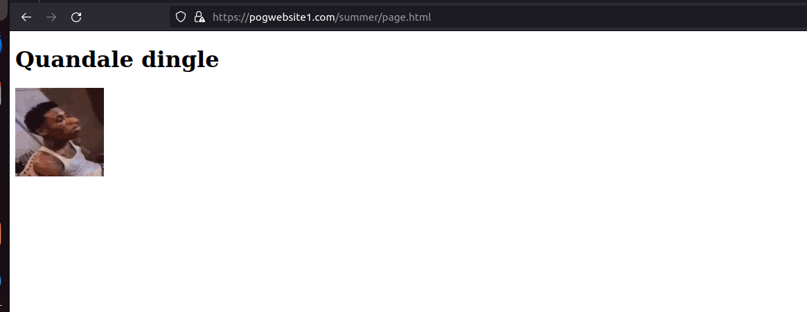

## Победа!!! 

Лаба выполнена, а у меня осталось целых 4 часа в запасе разгребать все остальные задания с дл 20 октября! 
